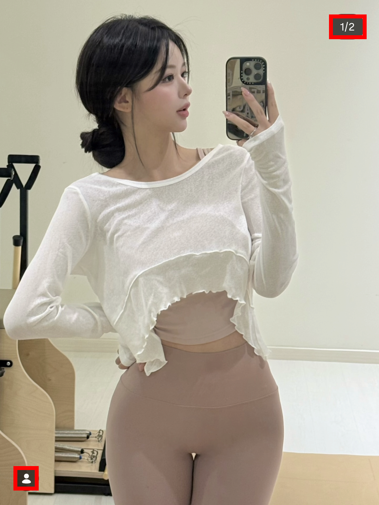
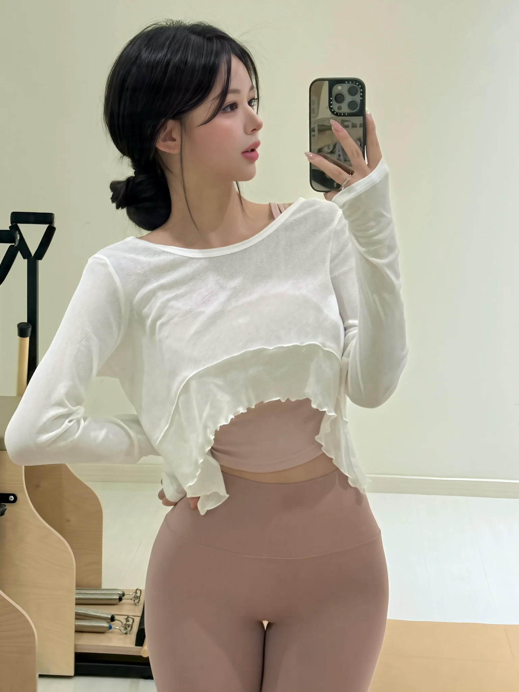
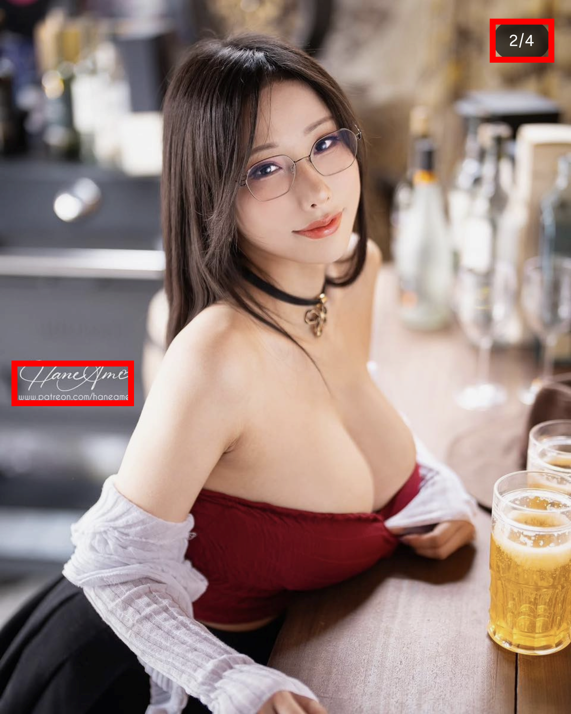
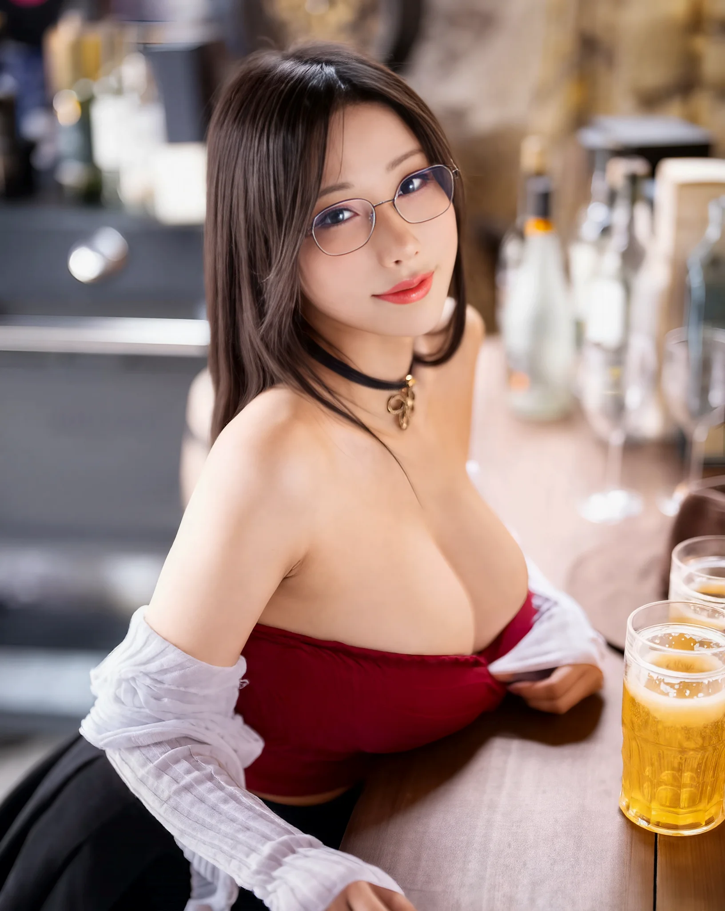

# Instagram Screenshot AI Magic Remastering

**A full-stack AI pipeline for restoring, enhancing, and curating daily life photography from Korea.**

This repository contains the source code for the "Instagram Screenshot AI Magic Remastering" project, a sophisticated automated workflow that turns low-quality screenshots into high-fidelity, gallery-quality images.

## Example Results

| Original Screenshot (2.0 MB) | Remastered (94 KB) |
|:----------------------------:|:------------------:|
|  |  |
| **Example 2 (2.1 MB)** | **Remastered (159 KB)** |
|  |  |

> **View more examples at the live gallery: [KoreaGallery.ink](https://koreagallery.ink)**

## System Architecture (Local Pipeline)

This repository focuses on the **Local AI Processing Chain**, running entirely on your machine (or local GPU workers). It decouples the intelligence from the serving layer.

### 1. The Core Pipeline
The workflow converts raw screenshots into gallery-ready images through a 4-stage process:

1.  **Deductive Detection (YOLO)**:
    *   Uses `structural_v2.pt` to identify UI elements (batteries, counters, hearts).
    *   Uses `content_v2.pt` to find watermarks and privacy-sensitive areas.
2.  **Precision Cleaning (SAM + LaMa)**:
    *   **SAM (Segment Anything)**: Refines YOLO bounding boxes into exact pixel-perfect masks.
    *   **LaMa (Large Mask Inpainting)**: Erases the masked areas using structural inpainting, preserving the background texture.
3.  **High-Fidelity Restoration (Flux)**:
    *   **RealESRGAN**: Upscales the cleaned image (x2) to restore sharpness.
    *   **Flux Img2Img**: Re-hallucinates skin texture, hair, and fabric details (Strength 0.4).
    *   **GFPGAN**: Restores facial features if they were distorted.
4.  **Final Assembly**:
    *   Color matching (histogram transfer) ensures the result feels natural.
    *   Optimization to WebP for final storage.

### 2. Key Tools
*   `pipeline/run_yolo_detection.py`: Identifies UI elements and watermarks using 4 YOLO models, outputting JSON coordinates.
*   `pipeline/run_sam_lama_local.py`: Generates pixel-perfect masks with SAM and erases artifacts using LaMa to create a clean base.
*   `pipeline/run_flux_restoration.py`: Enhances details using Flux Inpainting, upscales with RealESRGAN, and corrects faces with GFPGAN.
*   `pipeline/assemble_final.py`: Merges the clean base and enhanced details using Frequency Separation for a natural look.

## Operational Workflow

1.  **Input**: Place raw screenshots in the `input/` or `staging/` folder.
2.  **Detect & Clean**: Run the detection script to generate `cleaned` intermediate files.
3.  **Enhance**: Pass the cleaned files to the Flux pipeline.
4.  **Result**: Final high-quality images are saved to `output/`.

## Documentation

*   `LOCAL_INPAINT_WORKFLOW.md`: Detailed breakdown of the restoration logic.

---
*© 2025 KoreaGallery.ink*
